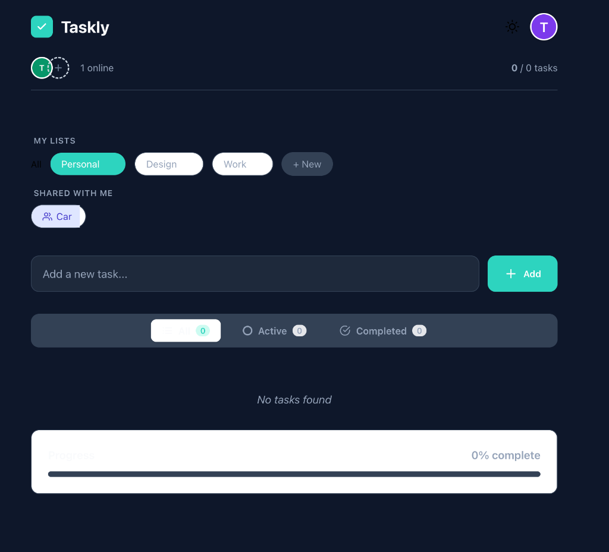

# Taskly - Collaborative Reminders App

# ⚡ Taskly Collaboration

[](https://taskly-collab.web.app)

> **"A simple way for families to organize life together."**
> Creates accounts, track personal to-dos, invite loved ones, and collaborate in real time—all in one place.
Taskly is a modern, real-time task management application designed for seamless collaboration. Built with React and Firebase, it allows you to manage your personal tasks and collaborate on shared lists with friends and colleagues in real-time.



### 🎥 Feature Showcase

## ✨ Key Features

### 📋 Smart List Management
- **Personal & Shared Lists**: Clearly distinguish between your private lists ("My Lists") and those shared with you ("Shared with Me").
- **Drag & Drop Sorting**: (Coming Soon) Intuitively reorder your tasks.
- **Customization**: Rename lists locally to organize them how *you* see fit, without affecting how others see them.

### 🤝 Real-time Collaboration
- **Instant Sync**: See tasks added, edited, or completed by others instantly.
- **Invite System**: Share any list by entering a user's email address.
- **Global Presence**: See who is online across all your lists in real-time. The "Online" indicator tracks friends even if you are viewing different lists.
- **User Attribution**:
    - **Hover Details**: See who owns a shared list.
    - **Task History**: Visual indicators show exactly who created or completed a task.
- **Smart Cleanup**: If a collaborator deletes their account, their contributions are preserved but marked as "Deleted User" so you never lose context.

### 📱 Premium Experience
- **iOS & Mobile Ready**: optimized for mobile devices with a native-like feel.
- **Dark Mode**: A beautiful, fully integrated dark theme for night-time productivity.
- **Onboarding Tour**: A helpful step-by-step tour guides new users through the main features.
- **Offline Intelligence**: The app handles connection drops gracefully and updates status instantly when users log out.

---

## 📖 User Guide

### 1. Getting Started
- **Sign Up**: Create an account using your email and password.
- **App Tour**: On your first login, a tour will highlight key features like creating lists and changing themes.

### 2. Managing Tasks
- **Create a List**: Click the **+ New** button in the sidebar to start a new list. Use "Personal" for private items or "Work" for shared projects.
- **Add Tasks**: Select a list and type directly into the input bar at the bottom. Press "Enter" to save.
- **Complete**: Click the circle icon to mark a task as done. It will move to the bottom and show your name as the completer.

### 3. Collaborating with Others
- **Invite a Friend**:
    1. Open the list you want to share.
    2. Click the **Invite Member (+)** icon in the top header.
    3. Enter the **exact email address** your friend used to sign up for Taskly.
    4. *Note: They must have an account for the invite to work.*
- **Accepting Invites**: Your friend will see an invite card appear at the top of their Dashboard. They can click **Accept** to join or **Reject** to decline.
- **Online Status**: Look at the top right header to see how many teammates are online. Hover over the avatars to see their specific emails.

### 4. Settings & Account
- **Dark Mode**: Toggle the Moon/Sun icon in the header to switch themes.
- **Delete Account**: Click your user avatar → Delete Account. **Warning**: This action is permanent!

---

## �️ Technical Setup (For Developers)

### Prerequisites
- Node.js (v16 or higher)
- npm or yarn

### Installation

1. **Clone the repository**
   ```bash
   git clone <repository-url>
   cd Taskly_collab
   ```

2. **Install dependencies**
   ```bash
   npm install
   ```

3. **Environment Setup**
   Create a `.env` file in the root directory with your Firebase configuration:
   ```env
   VITE_FIREBASE_API_KEY=your_api_key
   VITE_FIREBASE_AUTH_DOMAIN=your_project.firebaseapp.com
   VITE_FIREBASE_PROJECT_ID=your_project_id
   VITE_FIREBASE_STORAGE_BUCKET=your_bucket.appspot.com
   VITE_FIREBASE_MESSAGING_SENDER_ID=your_sender_id
   VITE_FIREBASE_APP_ID=your_app_id
   ```

4. **Run the Development Server**
   ```bash
   npm run dev
   ```
   Open [http://localhost:5173](http://localhost:5173) in your browser.

### iOS Build (Optional)
This project uses **Capacitor** for iOS deployment.
1. Ensure dependencies are installed: `npm install`
2. Build the web app: `npm run build`
3. Sync Capacitor: `npx cap sync`
4. Open Xcode: `npx cap open ios`

---

## 📄 License
This project is open-source and available for personal and educational use.
